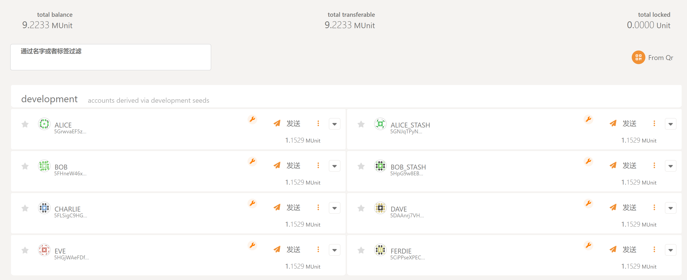

To test blockchain, you could try to run:

```bash
cargo run --example balance_check
```

You could get the information about test node:

```bash
Test account address: 5GrwvaEF5zXb26Fz9rcQpDWS57CtERHpNehXCPcNoHGKutQY
Balance:
  Free: 18446744073709551616 planck
  Reserved: 1152921504606846976 planck
  Total: 19599665578316398592 planck
```

And you could check it on [Polkadot.js Apps Accounts](https://polkadot.js.org/apps/#/accounts).
The information are same as what we printed:

